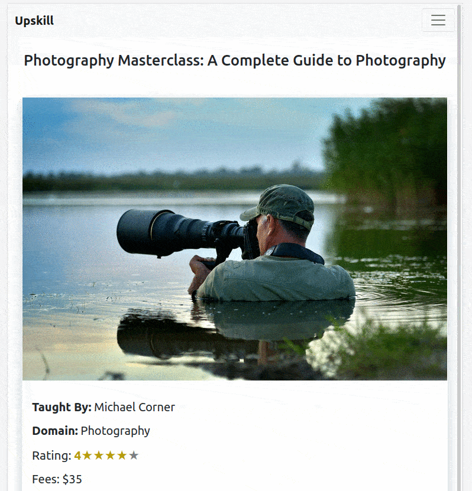

# Final Capstone Project: Find Your Course

Find Your Course is a The Final Capstone project as a part of the Microverse Curriculum. This is the front end build using React & Redux that accesses data from the Rails API, also built as a part of the project. A user can browse through multiple courses & add them to their watchlist if logged in. Design is based on - (https://www.behance.net/gallery/37706679/Circle-Landing-page-Dashboard-Mobile-App)

## MVP Features

- SignUp to receive auth tokens
- Login & receive auth tokens
- Go through course catalogue
- Add a course to your favorites list only if logged in
- Access all courses in your favorites list

## Find Your Course Screenshots

## Built With

- npm
- React
- React-DOM
- Redux
- CSS
- JSX

## Getting Started

To set up a local copy of the project

- `git clone git@github.com:akshay-narkar/Find-Your-Course.git`
- `cd final-branch`
- `git pull origin final-branch`

If you want to repack the file

- Run `npm install` on the terminal to install dependancies
- Run `npm run build` to bundle the files in the src folder & product ouput in dist folder
- Run `npm run start` to check live server

## Testing

- Jest Testing Framework has been used to test the Redux actions and reducers.
- Main React components have been tested with Snapshot testing.

- Run `npm run test` to run the tests

## Live Link of the project

[Live-Project](https://upskillmicroverse.netlify.app/)

## Author

👤 **Akshay Narkar**

- Github: [@akshay-narkar](https://github.com/akshay-narkar)
- Twitter: [Akshay](https://www.twitter.com/akidoit)
- Linkedin: [Akshay Narkar](https://www.linkedin.com/in/akshaynarkar25/)

## 🤝 Contributing

Contributions, issues, and feature requests are welcome!

## Show your support

Give a ⭐️ if you like this project!

## Acknowledgments

Design idea by [Alexey Savitskiy on Behance](https://www.behance.net/alexey_savitskiy)

## 📝 License

This project is [MIT](LICENSE) licensed.
